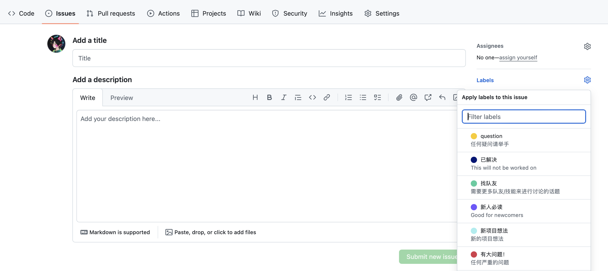
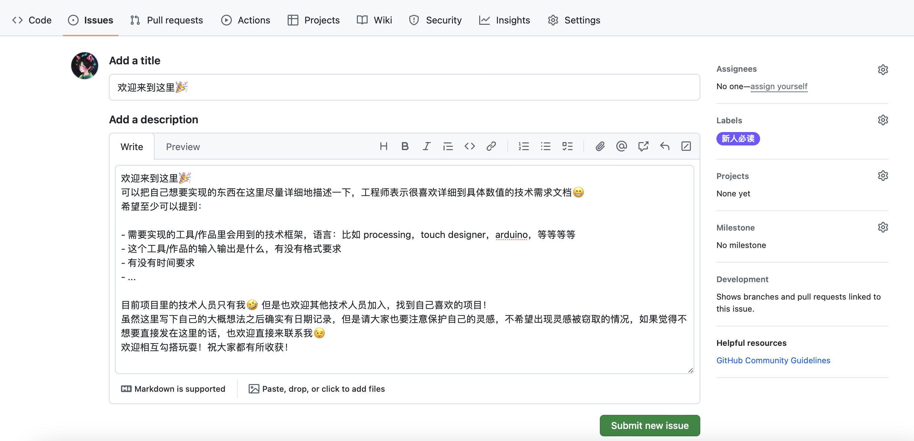
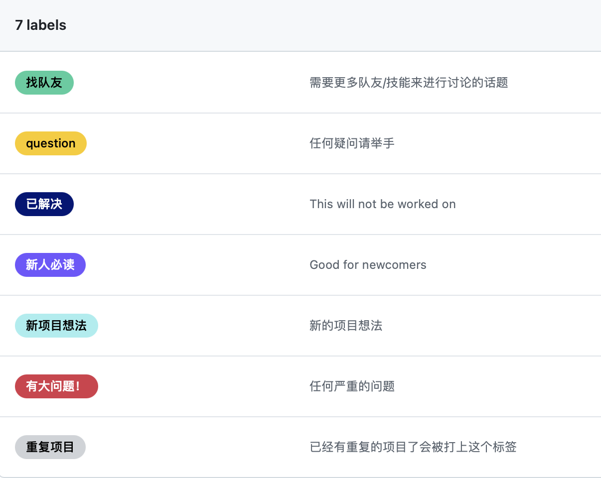

# The blue bird

欢迎来到这个 repo 🎉

发现有技术需求的伙伴还是挺多的，所以暂时用 github 作为一个快速整理的空间，稍微更有条理地整理一下大家的想法和各种需求，后续应该会（不停）变化，但是没关系，我们可以按需迭代，重要的是希望大家都能玩好😁

目前的项目规则如下：

1. 如果你有一个新的想法，可以去issues 里:创建一个新的 new issue，点击最右绿色按钮。然后，会进入到这个页面：点击右边的 labels，找到**新项目想法**，然后参照[欢迎来到这里 ](https://github.com/hyanworkspace/bluebird/issues/1)（这是一个超链接，请点进去看一下）这里的要求写一下大概的想法即可。请也留下一个你的联系方式，现在的设想比较随意，如果开始着手做这件事，应该就会开始一段沟通的过程，并且我想应该会尽量给一个交付时间，以免变成沉寂的线头...写完之后直接 submit 即可啦，比如这样：
2. 另外我还设了一些其他的 labels，大家可以按需使用，当然这些也是一拍脑袋想的，之后应该也会有调整。labels 如下，应该还是比较好懂的：

目前项目里的技术人员只有我🤣，不过我非常希望，并且似乎已经看到有不少理工科的同学想要加入。欢迎来找我，或者直接勾搭你喜欢的队友都可。

一些废话：

这个repo名字来源于Maurice Maeterlinck的童话剧《The Blue Bird》（青鸟）。下面是 GPT 对这个故事的一个描述截取：

> When they choose to share their happiness with others, they discover a deeper sense of peace and fulfillment within themselves. Along this path of exploration, the children not only witness the transformations of dreams but also experience the profound connections between souls.

希望这里有不同背景的大家可以分享自己的知识和想法，共创一些有意思的东西。
